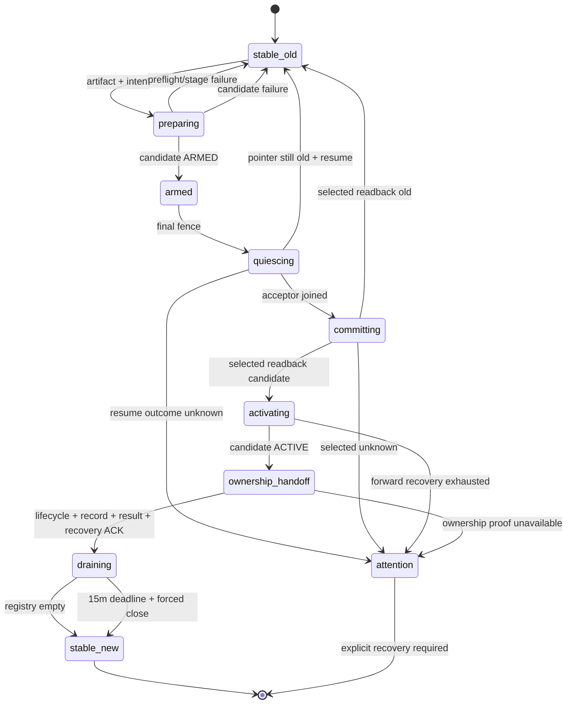

# zc 优雅二进制替换设计方案

> **状态：** Proposed — complete redesign
> **基线：** `355262eba78455b9b1e3c7c7b0ff0365ded98459`
> **目标平台：** Linux / macOS，amd64 / arm64，Zig 0.16.0
> **目标渠道：** 首个纵切面为standalone managed background daemon
> **研究依据：** `.agents/hot-upgrade-research.md`
> **替代关系：** 删除原“进程内配置代际切换”计划；本文件只设计zc binary replacement
> **工程要求：** TDD、小步commit、真实process tests、性能/资源门禁、用户行为同步文档

## 1. 目标

用户执行zc版本更新时，系统应当：

1. 新binary在old daemon仍正常服务时完成下载、校验和完整初始化；
2. New process复用old process正在使用的**同一个kernel listener**，不close/rebind；
3. Cutover后只有new process接收新连接；
4. Old process继续服务已经建立的TCP/UDP连接，直到完成或到达公开的drain deadline；
5. Candidate在commit前失败时，old保持原样；
6. Commit后的失败按selected new version向前恢复，不偷偷切回old；
7. 用户始终能看到selected、serving、candidate、draining、deadline和失败阶段；
8. 不把cold stop/start、端口重绑或自动fallback伪装成“优雅更新成功”。

本方案把该行为称为 **binary replacement（版本替换）**。它与`zc reload`、配置下载和进程内配置
mutation是不同问题，不能共用同一个模糊的“reload”概念。

### 1.1 一句话决策

采用窄化的 **NGINX/HAProxy式old→candidate handoff**：

```text
stage immutable candidate
→ old spawns candidate with inherited listener + daemon lock
→ candidate fully initializes and reports ARMED
→ old quiesces accept/control
→ atomically select candidate binary
→ candidate starts accepting
→ old drains established connections
```

### 1.2 这套方案能保证什么

在支持范围、协议正常执行且host/kernel未发生外部故障时：

- Candidate准备失败不会影响old接流量；
- Listener FD、bind、accept queue和daemon lock在replacement期间连续；
- Cutover不会产生close/rebind型`ECONNREFUSED`；短暂未accept时，新连接留在原backlog排队；
- Old已经接受的连接不会因binary cutover立即关闭；
- 同时最多存在active+candidate或active+draining两个process generations；
- Installer/CLI退出或等待超时不会改变已经作出的commit决定；
- 所有unsupported和failure都明确返回，不自动执行cold fallback。

### 1.3 不能承诺什么

任何实现都不能诚实承诺“绝对不会出问题”。本方案不保证：

- Host crash、kernel panic、OOM killer、外部`SIGKILL`或磁盘损坏时连接连续；
- Backlog在极端突发流量下永不耗尽；
- Candidate开始接流量后自身crash仍保住candidate已经接受的连接；
- 超过drain deadline的old connections永不关闭；
- 任意历史版本跨越式hot upgrade；
- Package manager或supervisor绕过zc protocol直接替换文件时仍满足handoff合同。

这些边界必须写进CLI help、install docs和release notes，不能只留在实现注释里。

---

## 2. 产品合同

### 2.1 首个支持范围

首个端到端版本只支持：

- Standalone versioned install layout；
- Managed background daemon；
- Authenticated、self-contained prepared invocation；
- 当前公开default runtime的一个mixed listener；
- Owner-only lifecycle Unix socket（只提供replacement/status/stop）；
- `external-controller == null`；
- Prepared config不包含AnyTLS proxy；
- Linux/macOS amd64/arm64；
- Old/new使用完全相同的config identity、prepared snapshot、port override和listener fingerprint；
- 同时没有另一笔replacement，也没有未完成的draining generation。

Foreground、systemd/launchd supervised、Homebrew/Debian ownership、unmanaged invocation、controller-enabled
runtime或AnyTLS config在任何selected-pointer mutation前返回`REPLACE_RUNTIME_UNSUPPORTED`。它们不会静默
cold restart。

### 2.2 Running install

用户继续使用现有入口，例如：

```bash
curl --proto '=https' --tlsv1.2 -fsSL \
  https://raw.githubusercontent.com/ekil1100/zc/main/install.sh | sh
```

如果daemon正在运行且满足支持范围，installer输出明确阶段：

```text
Staged zc 1.2.0 (sha256:...)
Candidate ready (pid ...)
Replacement committed; zc 1.2.0 is serving
Previous zc 1.1.0 is draining 3 connections until ...
```

Installer在candidate成为serving后返回成功，不等待最长15分钟drain。Drain继续由daemon管理并通过
`zc status`可见。

### 2.3 Stopped install

Daemon stopped时只做artifact publication与selected pointer commit：

```text
Installed zc 1.2.0
Daemon remains stopped
```

禁止installer因为“之前也许运行过”而猜测性启动daemon。

### 2.4 Failure

- Precommit failure：selected仍为old，old继续accept，返回具体错误；
- Postcommit failure：selected已经是candidate，只允许forward recovery；
- Outcome无法从selected pointer判定：进入`attention`，不得猜测性accept、rollback或cold start；
- Installer通过固定owner-only lifecycle socket提交/观察；CLI timeout返回transaction id，重试必须attach同一transaction；
- Selected入口损坏时，precommit intent、日志与installer输出必须给出old/candidate immutable executable的exact恢复命令；
- 显式`zc stop`可以终止所有generations，但必须列出将终止的PID并说明连接影响。

### 2.5 Rollback

不增加隐藏的自动rollback：

- Commit前abort/resume old属于同一transaction的正常失败处理；
- Commit后要回到old version，用户使用old immutable version发起一笔**新的replacement**；
- Standalone可通过固定旧版本重跑installer；
- 不提供能在candidate已接流量后反向偷切admission的phase-driving命令。

---

## 3. 为什么采用这个方向

| 成熟方案 | 已证明的模式 | zc采用 | zc不照搬 |
| --- | --- | --- | --- |
| NGINX executable upgrade | Old master启动new executable，传递listen FDs；old保留sockets，可恢复workers；old connections继续 | Parent直接spawn、exact listener inheritance、old drain | 手工signals与operator判断；zc增加机器可判定ACK和identity |
| HAProxy graceful reload | New boot完成后才`-sf`old；`-x`取回old listeners；`hard-stop-after`限制old寿命 | Full candidate prepare、soft drain、hard deadline | 普通pause/rebind fallback及对任意peer开放的FD retrieval |
| Envoy hot restart | New full init后取listener；existing connections不迁移；compatibility version与bounded drain | Protocol compatibility、listener option exactness、bounded drain | Shared memory、stats merge、restart epochs和多代管理 |
| systemd socket activation | Manager长期持有listener，restart期间kernel继续queue | 证明listener owner与daemon生命周期可分离 | Linux-only；普通restart不能保留old established connections |
| launchd socket activation | launchd预注册socket并传给daemon | 证明macOS同样支持外部socket ownership | 要求plist/supervisor lifecycle，不适合作为standalone默认 |
| Mihomo `/upgrade` | 覆写binary后hard restart/exec | 只作为“不要这样宣称无缝”的对照 | 无old/new overlap、listener handoff或connection drain |

### 3.1 为什么不是stop/install/start

当前`just install`已有backup、startup verify和rollback，能防止安装损坏，但old必须先停止。它解决的是
“能否恢复服务”，没有解决“existing connections和listener是否连续”。目标已经明确要求优雅替换，因此
cold transaction只能保留为用户显式选择，不是成功路径。

### 3.2 为什么不是`execve`当前进程

`execve`可以保留未设置CLOEXEC的FD，但会替换整个address space。Config、Engine、Manager、relay state、
TLS state和connection workers都会消失，existing connections无法继续正常处理。

### 3.3 为什么不是`SO_REUSEPORT`

`SO_REUSEPORT`创建第二个socket和第二个accept queue；kernel负责流量分配，old/new无法得到明确cutover，
rollback与高负载行为也更难证明。zc应继承**同一个listener FD/open file description**。

### 3.4 为什么不是通用`SCM_RIGHTS`

HAProxy/Envoy需要与独立process通信，因此使用Unix socket取FD是合理的。zc的old daemon就是candidate的
parent，可以在一次`posix_spawn`中精确映射FD；额外的命名socket、peer discovery和通用FD transport只会
增加攻击面与协议状态。

### 3.5 为什么需要immutable versions

如果直接覆写`${ZC_INSTALL_DIR}/zc`：

- Running old inode与磁盘new file容易产生身份错觉；
- Candidate失败后的old artifact可能已经丢失；
- Installer publication和runtime activation没有一个清晰的版本决策。

Content-addressed immutable artifact使old/new都保持可执行；一个atomic selected symlink即可表达“下一次CLI
和cold startup应使用哪个binary”。

---

## 4. 统一模型

| 术语 | 含义 |
| --- | --- |
| **Artifact** | 经过checksum/self-check、按SHA-256寻址且发布后不可修改的zc executable |
| **Selected Version** | `${ZC_INSTALL_DIR}/zc` symlink当前指向的artifact；唯一selection decision判据 |
| **Serving Process** | 当前负责新connection admission与control mutation的唯一process |
| **Candidate Process** | 已spawn并准备中，但尚未允许public admission的new process |
| **Draining Process** | 已不接新连接，只服务自身established connections的old process |
| **Replacement Transaction** | 一次old→candidate binary replacement，具有唯一transaction id |
| **Commit** | 本文简写为selected readback exact candidate；只表示selection，不隐含directory durability |
| **Precommit** | Selected pointer仍exact指向old artifact |
| **Postcommit** | Selected pointer readback exact指向candidate artifact |
| **Listener Set** | 可继承的process-owned listening FDs及其immutable fingerprint |
| **Connection Registry** | 一个process内所有established TCP/UDP lifetimes的owner/count barrier |
| **Runtime Record** | selected/serving/candidate/draining的可重建观测projection，不是第二个decision vote |
| **Lifecycle Endpoint** | Runtime dir内owner-only Unix socket；installer/CLI用于begin/observe/status/stop，不传FD或任意path |
| **Handoff Protocol** | Old/candidate private `HELLO→ARMED→ACTIVATE→ACTIVE→DRAIN_*`协议 |
| **Selection Durability** | Selected readback决定old/candidate；parent-directory sync单独决定`durable|uncertain` |

### 4.1 核心不变量

1. Selected pointer readback是唯一selection decision；PID file、ACK、runtime record都不是第二个vote；directory sync只记录durability。
2. Pointer=old时只有old可以admit；pointer=candidate后old永不resume admission。
3. Candidate在pointer commit前不能accept public traffic或公开control endpoint。
4. Old quiesce ACK后不能再创建connection registry entry。
5. Old与candidate持有同一个listener和daemon-lock open file description。
6. 双方只close自己的lock FD，禁止任何一方显式`LOCK_UN`。
7. Existing connections不跨process迁移。
8. Replacement不改变config、profile、listener options或port。
9. 同时最多两代process；存在draining时拒绝下一笔replacement。
10. Old只有在candidate接管lifecycle、serving record、terminal result与recovery ownership后才允许退出。
11. Precommit失败abort；postcommit失败forward；禁止隐式cold fallback。

---

## 5. 目标架构

```text
                         standalone installer
                  download → short locked artifact publish
                                 │
                    owner-only lifecycle socket
                                 │ begin(digest) / observe(tx)
                                 ▼
┌──────────────────────── old daemon ─────────────────────────┐
│ BinaryReplacementCoordinator                                │
│  ├─ VersionStore + inherited install-lock FD                │
│  ├─ RuntimeRecord                                           │
│  ├─ ListenerSet ─ mixed + lifecycle listener FDs ─┐         │
│  ├─ ConnectionRegistry                            │         │
│  └─ SpawnAdapter ─ daemon-lock/log/control FDs ───┼──┐      │
└───────────────────────────────────────────────────┘  │      │
                                                       ▼      │
                                              candidate daemon│
                                              full init, gated│
                                                       │      │
                  selected symlink decision            │      │
                           ─────────────────────────────┘      │
                                  │                           │
                     candidate accepts new                    │
                     old drains established                   │
```

不增加永久master process。只有replacement期间，old daemon临时承担coordinator职责。

---

## 6. 深modules与seams

### 6.1 `BinaryReplacementCoordinator`

**建议文件：** `src/binary_replacement.zig`

这是唯一外部replacement seam。Installer、CLI、main和tests不能自行拼接phases。

概念interface：

```zig
pub const BinaryReplacementCoordinator = opaque {
    pub fn begin(
        self: *BinaryReplacementCoordinator,
        candidate: VerifiedArtifact,
        options: Options,
    ) !BeginResult;

    pub fn observe(
        self: *BinaryReplacementCoordinator,
        transaction_id: TransactionId,
    ) !ReplacementStatus;
};
```

Interface必须隐藏：artifact identity、child spawn、FD manifest、protocol deadlines、quiesce、selected-pointer
decision、forward recovery、runtime projection和drain ownership。

Wire adapter是runtime dir内固定路径的owner-only lifecycle Unix socket；每个background daemon cold start都创建，
即使当前installation/invocation不支持replacement，也能提供status/stop与明确unsupported结果：

- 只提供`begin/observe/status/stop`；
- 以peer credentials、process nonce和transaction id认证；
- `begin`只接受已经发布到VersionStore的`artifact_digest`，不接受任意path、FD或`SCM_RIGHTS`；
- Socket listener属于ListenerSet并随candidate继承；existing installer connection可继续由old返回结果，新连接在ACTIVE后由candidate处理；
- RuntimeRecord损坏时仍可通过live lifecycle endpoint观察/停止；endpoint也失效时，输出中记录的immutable executable是人工恢复入口。

规则：

- Single-flight；已有transaction时相同candidate attach，不同candidate返回`REPLACE_IN_PROGRESS`；
- Caller退出不取消transaction；
- `begin`返回只表示request accepted，不代表commit；
- Success必须包含selected/serving identity和draining事实；
- Coordinator不调用普通`stopDaemon*`、`startDaemon()`或restart fallback；
- Old在candidate确认接管lifecycle、serving record、terminal result与recovery ownership前不得退出。

### 6.2 `VersionStore`

**建议文件：** `src/version_store.zig`

职责：

- 分离`archive_digest`（下载provenance）与`artifact_digest`（解包后executable bytes identity）；
- 以`artifact_digest`发布content-addressed immutable artifact；
- 验证regular file、owner、permissions、size、version、OS/arch和handoff capability；
- 读取并验证selected relative symlink；
- `select(expected_old, candidate)`执行same-directory temp symlink + atomic rename + parent sync；
- 返回`selection = old|candidate|unknown`与`durability = durable|uncertain`，不把sync error伪装成rollback；
- 保护active、candidate和draining artifacts不被删除。

Lock ownership固定为：

1. Installer下载时不持install lock；
2. VersionStore发布immutable artifact时短暂持stable advisory install lock，sync后释放；
3. Old收到`begin(digest)`后重新取得同一lock并重验expected selected；
4. Old把install-lock FD随candidate继承；双方持有到ACTIVE、terminal result和recovery ownership transfer完成后close；
5. Installer等待/attach期间不持lock；stopped flow由单个VersionStore process持锁完成publish+select。

首版不自动GC旧versions，避免在lifetime证明前加入删除策略。

### 6.3 `ListenerSet`

**建议文件：** `src/listener_set.zig`

把public mixed与owner-only lifecycle listener ownership从protocol accept stack提升到process lifetime。每个listener
明确`source = cold | inherited`：cold path执行bind/preflight，inherited path禁止port availability probe和rebind，只
验证kernel metadata与frozen fingerprint。

```zig
pub const ListenerSet = opaque {
    pub fn bindCold(...) !*ListenerSet;
    pub fn adoptInherited(...) !*ListenerSet;
    pub fn startAccepting(self: *ListenerSet, runtime: *Runtime) !void;
    pub fn pauseAndJoin(self: *ListenerSet) !void;
    pub fn resume(self: *ListenerSet) !void;
    pub fn manifest(self: *const ListenerSet) ListenerManifest;
};
```

Listener固定nonblocking；acceptor等待`poll(listener, pause_notifier)`，二者同时ready时优先处理pause。每次accept
后再次检查pause，并保证socket要么注册old registry、要么关闭。

`pauseAndJoin()`成功的定义：

- Notifier已经唤醒poll，acceptor thread已join；
- 每个in-flight accepted socket已经注册到ConnectionRegistry或关闭；
- 返回后old accept/registry count不可能再增加；
- Listener FD本身仍open且没有`shutdown()`。

Candidate `adoptInherited()`必须跳过现有bind/port probe，校验role、FD唯一性、`SO_TYPE`、`getsockname`、
address/port与platform可取得的listener state；任何差异在ARMED前失败。Connection代际以server成功
`accept()`并取得registry lease为界：quiesce ACK前old已accept的归old；backlog中尚未accept的只由ACTIVE
candidate取得，不能按client handshake发生在commit前后来推断。

### 6.4 `ConnectionRegistry`

**建议文件：** `src/connection_registry.zig`

- Accepted socket在worker spawn前注册；
- Worker owns一个stable lease；
- HTTP CONNECT、SOCKS TCP和SOCKS5 UDP association的完整lifetime都在lease内；
- Spawn失败按逆序release；
- Old quiesce后registry只减不增；
- `waitEmpty(deadline)`返回clean或forced count；
- Count无法确认时status显示`unavailable`，不得伪造0；
- Last worker只notify drain owner，不inline destroyConfig/Engine/Manager。

### 6.5 `RuntimeRecord`

现有`runtime_descriptor.zig`演进为单一runtime projection，删除`zc.pid`的authority语义。

最小字段：

```text
schema_version
record_epoch
installation = versioned { selected_version, artifact_digest, path }
             | unmanaged
runtime_snapshot {
  snapshot_id
  prepared_path + prepared_identity
  invocation { foreground, prepared, source_path, port_override, overrides }
  config_identity { key, revision }
  effective_mixed_port
  listener_manifest + listener_fingerprint
}
serving  { pid, nonce, version, artifact_digest, device, inode, snapshot_id }
candidate? { pid, nonce, version, artifact_digest, snapshot_id }
draining?  { pid, nonce, version, artifact_digest, snapshot_id,
             connections, deadline_boot, deadline_realtime }
replacement? { transaction_id, phase, drain_duration, started_at, last_error }
last_replacement?
```

规则：

- Atomic replace + parent sync；
- Old在precommit写；candidate ACTIVE后取得serving-writer ownership；
- Epoch/nonce CAS阻止draining old覆盖serving candidate；
- RuntimeRecord损坏/写失败不能改变selected pointer；
- Status必须同时呈现selected与serving，禁止假设二者永远相同；
- Foreground/unmanaged仍能使用普通start/status/stop/restart，只是replacement admission fail closed；
- Phase A只能从record中的exact immutable runtime snapshot读取scope/invocation/listener facts；
- Stop定位serving及draining processes，不再把独立PID file当唯一事实。

### 6.6 Platform `SpawnAdapter`

这是一个真实seam，因为Linux和macOS需要不同implementation/contract tests。

- 使用Zig 0.16 build-time C translation引入`<spawn.h>`；不使用deprecated `@cImport`；
- `posix_spawn` file actions只映射bootstrap socket、daemon lock、install lock、listener set和shared log FD；
- macOS使用`POSIX_SPAWN_CLOEXEC_DEFAULT`并显式allowlist manifest；
- Linux所有socket/accept/pipe creation优先使用atomic CLOEXEC；macOS或fallback的`accept→fcntl`路径必须与spawn共用一个短FD-table barrier；
- 任何CLOEXEC设置失败都hard fail，禁止当前忽略错误的做法进入replacement路径；
- Child验证manifest后立即为inherited FDs恢复CLOEXEC；
- 捕获shared log FD前必须取得rotation lease并等rotation loop ACK；lease保持到drain terminal后转给candidate；
- Child mode只接受private inherited bootstrap capability，直接从shell调用必须失败；
- 不提供任意path/任意FD的公共spawn interface。

---

## 7. Install layout与唯一selection decision

### 7.1 新layout

```text
${ZC_INSTALL_DIR}/
├── zc -> .zc/versions/sha256-<digest>/zc
└── .zc/
    ├── install.lock
    └── versions/
        ├── sha256-<old>/zc
        └── sha256-<candidate>/zc
```

Version file不可为symlink，发布后不原地chmod/write/replace。`${ZC_INSTALL_DIR}/zc`必须是owner-owned relative
symlink，且target必须解析到同一个`.zc/versions`root内。

### 7.2 Artifact publication不是runtime commit

Download、checksum、extract、self-check和version-dir publication都发生在old仍accept时。即使installer在这一步
退出，也只是多一个未selected artifact，不影响runtime。

### 7.3 唯一selection decision规则

唯一selection decision为：

```text
readlink(${ZC_INSTALL_DIR}/zc) == exact candidate artifact
```

Commit操作：

1. 确认coordinator仍持有Phase A取得的long install-lock FD；不得递归acquire；
2. Readback必须exact等于transaction记录的old target；
3. 在install dir创建owner-only temp relative symlink；
4. Atomic rename覆盖`zc`；
5. Sync install dir；
6. 再次readback并验证candidate digest/device/inode。

Outcome包含两个正交facts：

| Readback | Selection | 行为 |
| --- | --- | --- |
| exact old | Precommit | Abort candidate并resume old |
| exact candidate | Postcommit | 只forward activate/recover candidate |
| missing/third-party/unreadable | Attention | 双方不新增admission，保留证据等待同transaction恢复 |

| Parent sync | Durability |
| --- | --- |
| success | `durable` |
| error / 无法确认 | `durability_uncertain`；按readback方向继续，但不能声称durable success |

Rename返回值、directory sync错误、runtime ACK或CLI exit code都不能覆盖readback裁决。Host crash下
`durability_uncertain`可能改变cold-start结果，因此本方案不把它宣传为持久成功。

---

## 8. 完整replacement流程

### Phase A — Stage与preflight

1. Installer不持install lock地解析latest并下载archive/checksum；
2. 验证`archive_digest`、size、OS/arch和archive shape，安全解包后单独计算executable `artifact_digest`；
3. VersionStore短暂取得stable advisory install lock，在`.zc/versions/sha256-<artifact_digest>`发布并sync immutable candidate，然后释放lock；
4. 执行candidate`--version`与private compatibility probe；
5. Installer连接old lifecycle endpoint，只提交`artifact_digest`并取得transaction id；
6. Old coordinator取得install lock，重验selected、serving executable与RuntimeRecord exact snapshot；
7. 检查scope：managed background、prepared、one mixed、no controller、no AnyTLS、无candidate/draining；
8. 冻结old exact prepared invocation、listener fingerprint、old/new identities与`drain_duration=15m`；此时不计算绝对deadline；
9. 原子写precommit transaction intent及old/candidate immutable恢复命令；写/sync失败时不spawn、不quiesce。

### Phase B — Candidate ARMED

10. Old先暂停log rotation并取得rotation lease，然后创建private socketpair；
11. Old通过SpawnAdapter启动candidate，并继承public/lifecycle listeners、daemon lock、install lock、log FD和bootstrap channel；
12. Candidate验证bootstrap capability、protocol version、artifact identity和每个inherited FD，并恢复CLOEXEC；
13. Candidate走`ListenerSource.inherited`，跳过bind和port availability probe；
14. Candidate从old exact authenticated prepared snapshot构建Config、Engine、Manager及background resources；
15. Candidate不publish serving runtime、不accept public/lifecycle traffic、不开放controller；
16. Candidate验证最终listener/config fingerprint后发送`ARMED`；
17. Exec/init/validation/OOM/timeout发生时candidate退出，old继续accept，双方close install-lock refs，transaction返回precommit error。

### Phase C — Final fence与old quiesce

18. Old进入replacement mutation fence，拒绝新的config/restart/upgrade mutation；
19. 在StateAuthority guard下重读exact profile/revision与latest desired selection；变化则abort；
20. Candidate完成final selection reconcile；
21. Old调用`ListenerSet.pauseAndJoin()`，同时quiescepublic与lifecycle acceptors；已有installer connection保留；
22. Old确认acceptors已join且public registry从此只减不增；
23. Old仍持有listeners、daemon/install locks、runtime和existing connections；
24. Quiesce失败且selected仍为old时，old resume并abort。

### Phase D — Selected pointer decision

25. Coordinator调用`VersionStore.select(expected_old, candidate)`；
26. Readback=old：candidate退出，old resume；
27. Readback=unknown：进入attention，只允许可认证的lifecycle recovery，不猜测public admission；
28. Readback=candidate：replacement进入postcommit，old永不resume public/lifecycle admission；
29. 以同host `.boot` monotonic clock计算`deadline_boot = now + 15m`，另记录realtime仅用于展示；
30. 单独记录selection durability；sync error但readback=candidate时forward并携带`durability_uncertain`。

Selected readback是唯一selection decision。此前failure保old；此后failure只向selected candidate收敛。

### Phase E — Candidate ACTIVE与recovery ownership handoff

31. Coordinator发送`ACTIVATE(deadline_boot)`；
32. Candidate再次readback selected pointer，必须exact指向自身artifact；
33. Candidate以`activateOnce()`开启public/lifecycle gates；该步骤只做预先准备好的bounded wake操作；
34. Candidate发送`ACTIVE`，成为唯一serving process；
35. Candidate以新PID/nonce CAS更新RuntimeRecord：serving=candidate、draining=old；
36. Candidate把correlated terminal result持久化，并确认lifecycle endpoint已经接管；
37. Candidate发送`RECOVERY_OWNERSHIP_ACK`；随后old/candidate close各自install-lock FD，installer不持lock；
38. Old在收到上述四项证明前不得退出；installer确认selected、serving、artifact digest/device/inode与新PID后返回成功；
39. ACK/result丢失不rollback；重试通过lifecycle endpoint attach相同transaction。

Candidate在ARMED后遇到bootstrap EOF或ACTIVATE timeout时必须readback selected：exact old则退出；exact self则
幂等`activateOnce()`并接管lifecycle；unknown只开放lifecycle recovery、保持public gate关闭并进入attention。
Old在drain/finalization期间可对crashed candidate做有界的same-selected forward respawn，但永不恢复old admission。

### Phase F — Old drain

40. Old关闭mutation/control ownership，但继续运行Config、Engine、Manager与existing workers；
41. Old不再accept，只通过private channel发送有界有序`DRAIN_PROGRESS(count)`；candidate是唯一RuntimeRecord writer；
42. Registry归零时old发送`DRAIN_DONE(clean, 0)`并退出；candidate记录`completed_clean`；
43. Old自身和candidate watchdog都使用同一`.boot`deadline；candidate signal old前验证PID/nonce；
44. Deadline到期且old能报告时发送`DRAIN_DONE(forced, count)`后终止remaining connections；
45. Old crash/kill未提供terminal count时candidate记录`connections=unavailable`与continuity degraded，绝不伪造exact forced count；
46. Drain terminal后candidate恢复log rotation并结束transaction；此后candidate crash属于普通stable daemon failure，selected仍new，但不承诺自动forward；
47. Draining结束前下一次replacement返回`REPLACE_IN_PROGRESS`。

---

## 9. State machine



`stable_old`与`stable_new`都是正常stable状态，只是selected/serving artifact不同。

---

## 10. Failure语义

### 10.1 Precommit

| Failure | 必须发生的行为 |
| --- | --- |
| Download/archive digest/executable digest/self-check失败 | 不发布candidate，不碰runtime |
| Artifact publication或intent sync失败 | Old继续accept；不进入quiesce |
| Protocol/version mismatch | Candidate不启动或立即退出；old不变 |
| Child exec/FD validation失败 | Old继续accept；candidate清理 |
| Config/provider/resource/OOM失败 | Old继续accept；返回candidate failed |
| Final identity/selection变化 | Abort；old保持最新durable state |
| Quiesce失败 | Selected仍old时resume old；报告rolled back |
| Pointer operation后readback=old | Candidate退出；old resume；报告not committed |

### 10.2 Postcommit

| Failure | 必须发生的行为 |
| --- | --- |
| Directory sync报错但readback=candidate | `selection=candidate,durability=uncertain`并forward；不得宣称durable success |
| `ACTIVATE`/`ACTIVE` ACK丢失 | Candidate按selected执行`activateOnce()`；不得rollback |
| Candidate在ACTIVE前退出 | Old只可有界respawn同一个selected artifact；不得恢复old admission |
| Candidate在ACTIVE后、old drain结束前crash | 记录continuity degraded；old可forward same-selected，但不得resume old admission |
| Candidate在stable_new后crash | Transaction已结束；selected保持new，走普通显式`zc start`，不承诺自动forward |
| RuntimeRecord publication失败 | Candidate重试projection；old在recovery handoff前不得退出，selected decision不变 |
| Old在drain中crash | Candidate继续serving；old connections与count记lost/unavailable |
| Installer/CLI退出 | Coordinator继续；重试经lifecycle endpoint attach同transaction |
| Drain deadline | Candidate watchdog验证old identity；有terminal count才记forced count，否则记unavailable/degraded |

### 10.3 Attention

以下情况禁止自动猜测：

- Selected symlink missing；
- Selected指向versions root外或第三方artifact；
- Pointer identity无法读取；
- Runtime record与selected都不足以确定decision；
- Lock/listener ownership不再能证明。

Attention时public admission保持关闭，但可认证的lifecycle endpoint继续提供observe/status/stop。系统保留artifacts、
runtime record、logs和FD；precommit intent及installer输出给出old/candidate immutable executable的exact命令，
避免`${ZC_INSTALL_DIR}/zc`损坏后失去可信入口。禁止偷偷执行cold start。

---

## 11. Listener、connection与资源

### 11.1 Listener continuity

- Old/candidate引用同一组listener open file descriptions：public mixed与owner-only lifecycle；
- 不close/rebind、不调用`shutdown(listener)`、不改变socket options；
- Quiesce/activate控制acceptor，不控制listener lifetime；
- Kernel backlog在短暂无acceptor时继续存在；
- Listener fingerprint包含role、effective address、port、socket type及所有影响实际socket的options；
- New binary若期望不同listener semantics，必须在ARMED前拒绝replacement。

### 11.2 Existing connections

- Old已经accepted的TCP socket不传给candidate；
- HTTP CONNECT、SOCKS TCP、TLS/relay state保持在old worker；
- SOCKS5 UDP association与其control TCP留在old；
- Candidate只处理ACTIVE后由自身实际`accept()`取得的admissions；client handshake早于pointer decision但仍在backlog的连接也属于candidate；
- Old runtime只在registry归零或hard deadline后销毁。

### 11.3 Drain policy

首版固定hard deadline为selection decision后15分钟：

- Precommit intent只记录`drain_duration=15m`；readback=candidate时用`.boot` monotonic clock计算绝对deadline；
- RuntimeRecord另存realtime值只用于展示，不用于执行；
- `zc status`展示deadline、remaining connections与age；
- 归零立即退出，不故意等满15分钟；
- Candidate是shared projection writer与独立watchdog；old通过private channel发送progress/terminal；
- Deadline到期只有收到old terminal message才记录exact forced count，否则显示`unavailable/degraded`；
- 不把15分钟idle timeout误写成connection总寿命；这是replacement独立deadline。

固定deadline避免首版增加配置面；取得生产数据后再决定是否需要可配置。

### 11.4 Resource envelope

Old/new overlap会暂时拥有两份Config/Engine/Manager和各自limiter。为使首版资源上界可证明，AnyTLS
config在preflight明确unsupported；AnyTLS pool/session/thread/FD取得process-wide硬上界后再纳入：

- New process仍使用TCP 128 / UDP 64；
- Old只保留cutover时已经存在的最多TCP 128 / UDP 64；
- 显式峰值上界为TCP 256 / UDP 128及约两份process runtime；
- 不宣称跨process仍共享单一128/64 quota；
- 性能门禁必须测无AnyTLS的最大支持配置+最大old connections+candidate startup；
- 首版不为一个短暂overlap引入shared-memory quota protocol。

### 11.5 Logs

- Candidate继承old已打开的append log FD；
- 每条upgrade相关日志包含PID、version、transaction id和phase；
- Overlap期间暂停rotation；
- Old退出后candidate恢复rotation owner；
- Rotation lease必须在candidate spawn前取得，不能延后到drain功能阶段；
- 任一phase的日志失败不能改变selected-version decision。

---

## 12. Compatibility与security

### 12.1 Exact handoff protocol

Candidate提供machine-readable compatibility probe：

```json
{
  "protocol": 1,
  "runtime_schema": 1,
  "version": "1.2.0",
  "build_id": "sha256:..."
}
```

- Old/new protocol与runtime schema必须exact匹配；
- Release CI至少验证previous stable→current；
- Protocol bump不保留compatibility fallback，明确要求一次cold bootstrap；
- Arbitrary version skip不承诺；不兼容时old保持运行。

### 12.2 Child authentication

- `--replacement-child`不是公开用户入口；
- 必须同时具有inherited bootstrap FD、one-time capability和matching transaction id；
- Bootstrap/drain channel只存在于parent/child，不创建named FD-transport socket；owner-only lifecycle socket是独立的begin/observe/status/stop入口，不传FD；
- Malformed、duplicate、unknown-role FD立即失败；
- Candidate不得信任environment中的path/FD number而跳过kernel-level验证。

### 12.3 Artifact security

- Artifact regular、owner-owned、不可group/world writable、不可symlink；
- `archive_digest`只证明download provenance；解包后重新计算的`artifact_digest`才用于version path、selected、RuntimeRecord与self-identity；
- Candidate启动后再次证明自己的device/inode/digest；
- Selected必须是versions root内relative symlink；
- Install dir与versions dirs收敛为owner-only；
- Artifact publish短锁与running replacement长锁不重叠；old/candidate持长锁到recovery ownership handoff，installer等待时不持锁；
- 不接受runtime request提供的任意executable path。

### 12.4 Daemon lock

- Old锁FD经spawn duplicate后与candidate引用同一个open file description；
- Old/candidate只能close，绝不能显式unlock；
- Candidate、cutover和drain期间第三个`zc start`始终失败；
- Linux/macOS真实process tests是release blocker。

---

## 13. CLI、status与可观测性

### 13.1 Installer输出

Progress写stderr；成功stdout保持单一结果。JSON模式保持单envelope。

成功返回不写模糊的`updated`，而是：

```json
{
  "action": "replace",
  "state": "serving",
  "transaction_id": "...",
  "selected": {"version":"1.2.0","artifact_digest":"sha256:...","durability":"durable"},
  "serving": {"pid":1234,"version":"1.2.0","artifact_digest":"sha256:..."},
  "draining": {"pid":1200,"version":"1.1.0","connections":3,"deadline":"..."},
  "continuity": "preserved"
}
```

### 13.2 `zc status`

Text固定显示：

```text
state: running
selected: zc 1.2.0 sha256:...
serving: pid 1234 zc 1.2.0
replacement: draining
previous: pid 1200 zc 1.1.0
connections: 3
drain_deadline: ...
continuity: preserved
```

无法读取drain count时显示`connections: unavailable`，不能显示0。RuntimeRecord损坏但lifecycle endpoint仍live时，
status通过endpoint返回内存事实并明确`projection: unavailable`；两者都失效时输出immutable recovery commands。

### 13.3 Stable error codes

| Code | 含义 |
| --- | --- |
| `REPLACE_RUNTIME_UNSUPPORTED` | Invocation/packaging/listener shape或AnyTLS config不支持 |
| `REPLACE_PROTOCOL_INCOMPATIBLE` | Old/new handoff protocol不匹配 |
| `REPLACE_ARTIFACT_INVALID` | Candidate checksum/identity/layout无效 |
| `REPLACE_CANDIDATE_FAILED` | Candidate exec/init/validation失败 |
| `REPLACE_STALE_RUNTIME` | Config/identity/runtime在prepare期间变化 |
| `REPLACE_IN_PROGRESS` | 已有candidate或draining generation |
| `REPLACE_FAILED_ROLLED_BACK` | Precommit failure，old已确认resume |
| `REPLACE_ROLLBACK_FAILED` | Selected仍old但old无法resume |
| `REPLACE_WAIT_TIMEOUT` | Caller等待超时；transaction继续 |
| `REPLACE_OUTCOME_UNKNOWN` | Selected pointer无法裁决，进入attention |
| `REPLACE_DRAIN_FORCED` | Deadline关闭remaining old connections |
| `REPLACE_CONTINUITY_DEGRADED` | Candidate/old crash导致连接损失 |

### 13.4 Command interaction

- Installer通过lifecycle socket提交digest与观察transaction；不直接驱动phase；
- Replacement期间新的install/replacement/restart返回`REPLACE_IN_PROGRESS`；
- `zc status`和`zc log`始终允许；
- `zc stop`是唯一主动终止所有generations的命令，必须明确连接影响；
- Config mutation在final fence期间返回busy/retry；
- Binary replacement不触发`zc reload`，也不改变config revision。

---

## 14. Packaging与rollout

### 14.1 Standalone

这是首个完整支持渠道。`install.sh`、`local-dev-install.sh`和`just install`必须共享同一个VersionStore /
replacement contract，不再各自实现shell stop/copy/start/rollback状态机。

Shell负责download/extract；所有identity、publication、runtime handoff和result裁决由zc binary完成。

### 14.2 首次cold bootstrap

当前已发布binary：

- 不认识handoff protocol；
- 安装在single regular file；
- Installer拒绝symlink；
- Listener/connection没有handoff seam。

因此升级到首个handoff-capable/layout-capable版本必须明确执行一次：

```text
zc stop
install new versioned layout
zc start
```

Installer必须提前说明连接会中断并要求显式确认/步骤；不能把这次bootstrap宣传为graceful。

之后exact-compatible releases才能使用old→candidate replacement。

### 14.3 Homebrew / Debian / supervisors

首版fail closed，不抢夺package manager ownership。原因：

- Homebrew Cellar symlink publication由brew控制；
- systemd/launchd对process ownership、socket ownership和restart有各自合同；
- 外部manager若在zc transaction外替换selected path，会破坏唯一selection decision。

后续只有在有第二个真实adapter和对应E2E后，才增加package/supervisor seam；不提前设计通用framework。

---

## 15. TDD实施任务

每个Task是一个可独立验收的milestone；内部按一个逻辑变更一个commit继续拆分。

### Task 0 — 冻结合同与平台证据

先写红测/探针：

- [ ] Linux/macOS amd64/arm64 `posix_spawn` exact FD mapping；
- [ ] Same listener/open-file-description与same accept queue；
- [ ] Inherited`flock`连续、close-only、第三process被拒绝；
- [ ] Parent/child CLOEXEC allowlist；accept/connect/pipe创建与spawn并发时无unrelated FD leak；
- [ ] Stable advisory install lock的short-publish/long-replacement ownership与inheritance；
- [ ] Owner-only lifecycle Unix socket的peer credentials、inheritance与selected-path损坏时可达性；
- [ ] macOS signed candidate执行与listener metadata验证；
- [ ] Atomic relative-symlink replace、directory sync、readback selection与durability outcome；
- [ ] 冻结15分钟deadline、two-generation envelope和stable errors。

**Acceptance：** 任一目标平台无法证明listener/lock合同，则该平台不进入实现；不添加fallback。

### Task 1 — Immutable VersionStore，先支持stopped install

- [ ] 分开测试archive digest与executable artifact digest、same-version/different-artifact、owner/mode/symlink/path traversal；
- [ ] 实现以artifact digest寻址的publication；
- [ ] 实现expected-old selected symlink CAS/readback；
- [ ] 改造stopped installer：只select、不start；
- [ ] 覆盖每个rename/sync fault与SIGTERM cleanup。

**Acceptance：** Stopped安装幂等；rename前失败保持old，rename后严格按readback分类；sync error不会伪装成old或durable success；不误启动daemon。

### Task 2 — RuntimeRecord替代PID authority

- [ ] 先写`installation=versioned|unmanaged`、exact runtime snapshot、selected/serving/candidate/draining BDD；
- [ ] 增加restart-preservation、foreground/unmanaged lifecycle与Phase A scope-readback tests；
- [ ] 实现epoch/nonce CAS和atomic publication；
- [ ] Stop/status改为RuntimeRecord + lock/process identity；
- [ ] 删除`zc.pid`authority和兼容路径；
- [ ] 损坏/stale writer/unknown count fail closed。

**Acceptance：** 单process现有start/status/stop/restart全green；selected与serving可以不同且不会被误报。

### Task 3 — ListenerSet与ConnectionRegistry

- [ ] Mixed与lifecycle listeners从accept stack提升为process owner；
- [ ] 实现`ListenerSource=cold|inherited`；inherited path跳过bind/port probe；
- [ ] Listener改为nonblocking`poll(listener, notifier)`，实现pause-first、post-accept recheck、join/resume；
- [ ] 所有accepted TCP在spawn前注册lease；
- [ ] SOCKS5 UDP association完整注册；
- [ ] Fatal accept、spawn failure、slow child、last lease race tests；
- [ ] 保持cold start行为与TCP 128/UDP 64限制。

**Acceptance：** Quiesce ACK后old registry只减不增；registry=0前runtime绝不析构。

### Task 4 — SpawnAdapter与ARMED-only candidate

- [ ] Build-time translate`<spawn.h>`，实现Linux/macOS adapters；
- [ ] Private child capability、fixed FD manifest、CLOEXEC-default/atomic-CLOEXEC/FD-table barrier；
- [ ] Candidate adopt/validate public+lifecycle listeners、daemon/install locks；
- [ ] Candidate spawn前取得log rotation lease并验证overlap期间不会rotate到不同inode；
- [ ] 补self-contained prepared tests：candidate build不得读取mutable profile/provider source/cache或network；
- [ ] Candidate用exact prepared snapshot完整初始化但不accept；
- [ ] 实现`HELLO→ARMED→ABORT`，尚不做cutover；
- [ ] Protocol/FD/config/OOM/timeout fault matrix。

**Acceptance：** Candidate ARMED期间old持续正常流量；abort后资源、FD、process恢复baseline。

### Task 5 — BinaryReplacementCoordinator commit纵切面

- [ ] 实现lifecycle`begin(digest)/observe`、single-flight transaction与installer attach；
- [ ] Old取得/继承long install lock，installer等待期间不持lock；
- [ ] Final mutation fence、selection reconcile和old quiesce；
- [ ] 实现selected pointer唯一selection decision与独立durability；
- [ ] 实现`ACTIVATE→ACTIVE→RECOVERY_OWNERSHIP_ACK`与serving/lifecycle writer transfer；
- [ ] 实现candidate bootstrap-EOF self-decision、precommit resume、postcommit bounded forward和attention；
- [ ] 禁止调用普通stop/start/rebind。

**Acceptance：** 真实old/new不同digest/PID/inode；continuous connect在定义负载下无refused；listener identity不变。

### Task 6 — Drain、status与logs

- [ ] Old registry clean drain；
- [ ] Pointer decision时以`.boot`计算15分钟deadline，realtime只展示；
- [ ] 实现`DRAIN_PROGRESS/DRAIN_DONE`、candidate watchdog、PID/nonce校验和unavailable count；
- [ ] Status text/JSON展示selected/serving/candidate/draining；
- [ ] 补PID/version/tx log tagging与drain terminal后的rotation ownership transfer；
- [ ] Stop终止所有generations并明确影响；
- [ ] Draining期间拒绝第二replacement。

**Acceptance：** Long TCP和UDP跨cutover继续；clean/forced/degraded结果可区分且不会伪造count。

### Task 7 — 统一installer UX

- [ ] `install.sh`下载后调用VersionStore/replacement seam；
- [ ] `local-dev-install.sh`与`just install`删除重复cold orchestration；
- [ ] Stopped/running/unsupported/first-bootstrap UX；
- [ ] Progress stderr、stdout/JSON single result；
- [ ] CLI timeout重试attach相同transaction；
- [ ] 同步install/CLI/reliability docs和CHANGELOG。

**Acceptance：** Running支持路径无stop/start；unsupported不修改selected；用户能复制执行next step。

### Task 8 — Fault、scenario、performance与release gate

- [ ] 每个phase对installer/old/candidate注入TERM/KILL/EOF；
- [ ] Rename/sync/readback/runtime publication/control ACK全部fault points；
- [ ] Continuous connect、long HTTP CONNECT、SOCKS TCP、UDP association；
- [ ] AnyTLS config在pointer mutation前稳定拒绝；
- [ ] 无AnyTLS最大支持config + old 128/64 + candidate 128/64 RSS/FD/thread peak；
- [ ] 100轮clean replacement无process/FD/artifact-reference leak；
- [ ] Previous stable→current四架构real-binary matrix；
- [ ] Release gate禁止缺少compatibility fixture的tag。

**Acceptance：** §17全部成立；性能不越冻结阈值；没有hidden cold fallback或unverified platform。

### Task 9 — 后续扩展，不阻塞MVP

- [ ] 把API controller listener纳入ListenerSet后再支持controller-enabled runtime；
- [ ] 有真实systemd/launchd/Homebrew adapter需求时再设计第二adapter；
- [ ] 有生产drain数据后再决定deadline是否可配置；
- [ ] 为AnyTLS建立process-wide pool/session/thread/FD硬上界后再纳入replacement；
- [ ] 有artifact磁盘压力证据后再设计GC。

这些不是首个纵切面的一部分，不预埋stub或兼容层。

---

## 16. 测试矩阵与门禁

### 16.1 Correctness

- Candidate preflight失败：old PID、listener、selected、traffic完全不变；
- Quiesce ACK后old新增registry entry=0；
- Quiesce ACK前old成功accept并注册的连接归old；backlog中未accept的连接只由ACTIVE candidate取得；
- Listener device/inode/socket identity与local address/port全程一致；
- Old TCP/UDP连接持续传输到结束或明确deadline；
- Third daemon start全程失败；
- Runtime stale writer不能覆盖new serving；
- Config identity/port/overrides在binary replacement前后完全相同；
- Installer timeout后重试不spawn第二candidate。

### 16.2 Fault matrix

至少覆盖：

```text
archive digest / artifact digest / artifact create/write/file sync/dir sync
install-lock acquire/inherit/release + competing installer
lifecycle begin/attach/peer credentials + selected CLI path missing
intent write/sync
socketpair/spawn/exec + concurrent accept/connect FD creation
FD manifest read/validation + CLOEXEC failure
candidate parse/init/OOM
ARMED send/receive/timeout
mutation fence/final selection
acceptor wake/join
selected symlink create/rename/sync/readback
ACTIVATE send / bootstrap EOF / candidate exit / ACTIVE or recovery-ownership ACK loss
runtime record CAS/write/sync
DRAIN_PROGRESS/DRAIN_DONE loss / old crash / candidate watchdog / deadline
installer exit before and after every phase
```

每个fault都必须断言selected readback、admission owner、listener/lock lifetime、process count、artifact ownership和
用户结果。

### 16.3 Scenario

- 定义rate/backlog/headroom的continuous connect，replacement-induced refused=0；
- 长时间HTTP CONNECT双向流量；
- SOCKS TCP双向流量；
- SOCKS5 UDP association在cutover前建立、cutover后继续；
- Candidate在ARMED、quiesce、postcommit pre-ACTIVE、ACTIVE和drain各阶段退出；
- Old在accept、quiesce、postcommit和drain各阶段退出；
- Installer在每个阶段退出并重试attach；
- 15分钟deadline用test clock缩短，分别验证reported forced count与unavailable/degraded；
- Draining期间status、stop和第二replacement。

### 16.4 Performance/resource

先记录baseline再冻结阈值：

- Candidate full-init latency；
- Old quiesce latency；
- Pointer selection decision + candidate activation latency；
- Connect p50/p95/p99与throughput；
- Max overlap RSS、FD、threads；
- Drain observation overhead；
- 100轮replacement终态；
- Log throughput与rotation恢复。

---

## 17. 总体验收标准

只有全部满足，才能对外称“优雅版本替换”：

1. Running supported install从不调用普通stop/start。
2. Candidate在old停止accept前完成cold-start等价初始化。
3. Replacement前后使用同一个listener/open file description和accept queue。
4. Old quiesce ACK后不再创建connection entry。
5. Selected symlink readback是唯一selection decision；parent sync单独报告durable/uncertain。
6. Precommit任何失败保持或确认恢复old admission。
7. Transaction postcommit failure不自动切回old，只向selected candidate恢复；stable_new后的普通crash不冒充upgrade recovery。
8. Candidate ACTIVE前不接public mixed traffic；attention只可开放认证lifecycle recovery。
9. Existing TCP/UDP连接留在old并drain；deadline forced/unavailable结果明确可见。
10. Daemon与install locks按各自合同连续，第三instance/installer不能干扰cutover。
11. Config/profile/port/overrides/listener options不随binary replacement变化。
12. Installer/CLI通过owner-only lifecycle endpoint timeout/reattach，不产生第二transaction。
13. Status准确显示selected、serving、candidate、draining、deadline和continuity。
14. Unknown/unavailable不伪造为success/0/clean。
15. Unsupported mode在pointer mutation前失败且无cold fallback。
16. 四个平台真实process contracts和previous-stable→current E2E通过。
17. 定义负载下close/rebind型refused=0，无AnyTLS两代资源峰值不越门禁。
18. 首次cold bootstrap、MVP范围和非保证项已进入用户文档。

---

## 18. 预计文件变化

### 新增

```text
src/binary_replacement.zig
src/binary_replacement_test.zig
src/version_store.zig
src/version_store_test.zig
src/listener_set.zig
src/listener_set_test.zig
src/connection_registry.zig
src/connection_registry_test.zig
src/replacement_process_test.zig
```

### 主要修改

```text
src/main.zig
src/daemon.zig
src/runtime_descriptor.zig
src/proxy/mixed.zig
src/proxy/socks5_udp.zig
src/api/server.zig        # MVP只改ownership seam，不handoff controller
src/integration_error_test.zig
build.zig
install.sh
scripts/install/local-dev-install.sh
scripts/install/*regression*
Justfile
```

### 文档

```text
README.md
CHANGELOG.md
docs/install/README.md
docs/cli/README.md
docs/cli/spec.md
docs/cli/ux-workflow.md
docs/reliability/e2e.md
docs/api/error-codes.md
docs/compat/mihomo-clash.md
```

---

## 19. 明确删除的旧方向

以下内容不再属于本计划：

- 进程内`RuntimeGeneration`作为更新zc binary的主方案；
- `zc reload`配置代际切换任务；
- Config pointer swap、generation lease与single-retired config设计；
- Binary update继续固定为cold stop/install/start的结论；
- Running installer只报错而不提供handoff的最终状态；
- `auto` fallback与把cold restart包装成hot success；
- `SO_REUSEPORT`、close/rebind、端口自动漂移；
- 通用`SCM_RIGHTS`/FD broker framework；
- 永久master process或stable launcher；
- Established connection migration；
- 多个draining generations；
- Postcommit自动rollback；
- 首版shared-memory quota、stats migration、artifact GC与通用supervisor abstraction。

---

## 20. 实施前Go/No-Go

Task 1开始前必须确认：

- [ ] 目标是binary replacement，不再把config reload当替代方案；
- [ ] 接受首个capable版本需要一次显式cold bootstrap；
- [ ] 接受MVP仅standalone managed background + mixed + no controller；
- [ ] 接受selected symlink readback是唯一selection decision、durability单独报告，transaction postcommit只forward；
- [ ] 接受existing connections不迁移，最多drain15分钟；
- [ ] 接受overlap资源上界暂时为两代process；
- [ ] Linux/macOS listener/flock/spawn/symlink真实合同已经通过；
- [ ] Stable error、status schema与failure matrix已经评审；
- [ ] 团队确认不实现§19中的fallback、兼容层或推测性framework。

任一项未满足，不进入产品代码实现。
